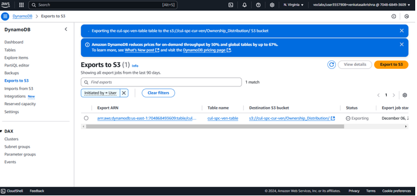

# Data Quality Control

## Project Description: Data Quality Control Initiative at ABC Enterprises
This project focuses on implementing data quality control measures to ensure accurate, reliable, and actionable data for business insights. It leverages AWS tools like DynamoDB, S3, Glue, and Athena to achieve high standards of data governance and analytics.

---

## Project Title:
Data Quality Control Initiative City of vancouver

---

## Objective:
To establish a robust data analytics platform that:
1. Ensures data accuracy, consistency, and completeness.
2. Provides actionable insights into cultural space distribution and ownership.
3. Enables secure and reliable data storage, processing, and governance.

---

## Background:
Inconsistent and incomplete datasets often lead to unreliable analysis and decision-making. This initiative addresses these challenges by implementing state-of-the-art data quality measures using AWS technologies.

---

## Scope:
The project involves:
1. Data ingestion, profiling, and cleaning.
2. Implementation of encryption and versioning for data protection.
3. Designing an ETL pipeline to process, transform, and validate datasets.
4. Establishing observability using AWS CloudWatch for monitoring.

---

## Methodology:
### 1. Data Enrichment
- **DynamoDB Creation**: Data stored in DynamoDB for scalability and flexibility.  
- **Export to S3**: Secure storage and direct integration with AWS analytics tools like Glue and Athena.

  

### 2. Data Protection
- **AWS KMS Encryption**: Ensured confidentiality by encrypting sensitive data.  
- **Bucket Versioning**: Implemented to safeguard against accidental overwrites or deletions.

  

### 3. Data Governance
- **ETL Pipeline**: Built using AWS Glue to ensure data quality and organize processed data into designated folders.  
- **Sensitive Data Detection**: Verified the dataset to ensure compliance with data protection standards.

  

### 4. Data Observability
- **CloudWatch Monitoring**: Created dashboards for key metrics, anomaly detection, and cost management.

  

---

## Deliverables:
1. Cleaned and validated datasets, ready for analysis.
2. Data profiling reports highlighting data quality insights.
3. ETL pipelines for repeatable data processing.
4. Dashboards for real-time data observability and cost tracking.

---

## Timeline:
The project timeline is divided into the following phases:
1. **Week 1-2**: Data ingestion and profiling.
2. **Week 3-4**: Data cleaning and enrichment.
3. **Week 5-6**: ETL pipeline design and implementation.
4. **Week 7**: Data governance and observability setup.
5. **Week 8**: Final review and deliverable submission.
